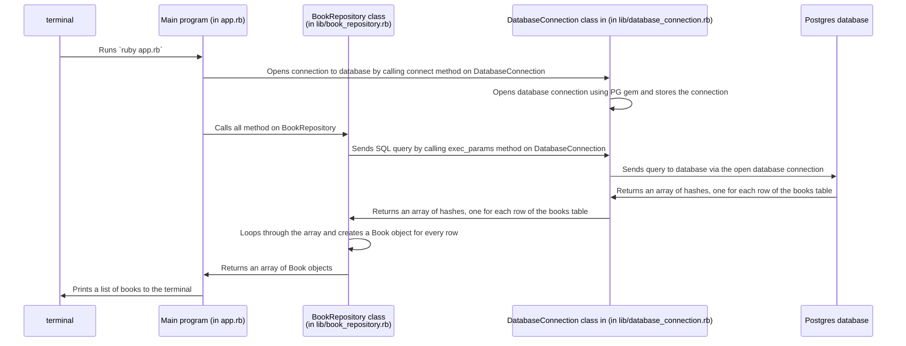

```mermaid
sequenceDiagram
participant t as terminal
    participant app as Main program (in app.rb)
    participant ar as BookRepository class <br /> (in lib/book_repository.rb)
    participant db_conn as DatabaseConnection class in (in lib/database_connection.rb)
    participant db as Postgres database

    t->>app: Runs `ruby app.rb`
    app->>db_conn: Opens connection to database by calling connect method on DatabaseConnection
    db_conn->>db_conn: Opens database connection using PG gem and stores the connection
    app->>ar: Calls all method on BookRepository
    ar->>db_conn: Sends SQL query by calling exec_params method on DatabaseConnection
    db_conn->>db: Sends query to database via the open database connection
    db->>db_conn: Returns an array of hashes, one for each row of the books table
    db_conn->>ar: Returns an array of hashes, one for each row of the books table
    ar->>ar: Loops through the array and creates a Book object for every row
    ar->>app: Returns an array of Book objects
    app->>t: Prints a list of books to the terminal
```
